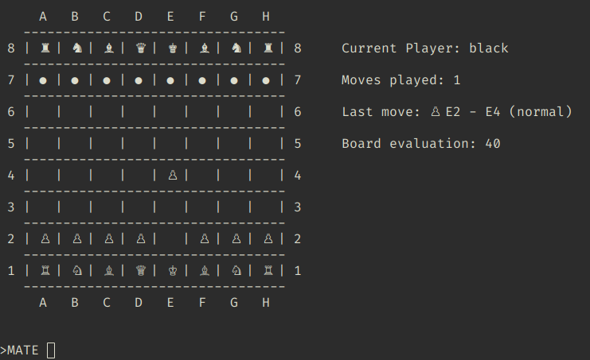

# Mate

Mate is a terminal chess program with:

- a menu-driven CLI
- a board editor for custom positions
- a simple minimax engine with optional alpha-beta pruning
- SQLite save/load support
- TCP network play with chat
- optional ONNX-based move inference



## Highlights

- Start from the standard chess opening or from a custom board
- Play manual, random, smart-engine, or optional ML-generated moves
- Undo using full board/state snapshots
- Save complete games and board snapshots to SQLite
- Browse saved games interactively from the terminal
- Host or join a network game with player names and chat
- Build and test on GitHub Actions with a Linux CI workflow

## Requirements

- C++17 compiler
- CMake 3.16+
- SQLite3 development headers and library
- SDL2, FreeType, and Fontconfig development headers and libraries only when you want the optional GUI window
- ONNX Runtime only when building with `MATE_ENABLE_ONNX=ON`

Ubuntu/Debian example:

```bash
sudo apt update
sudo apt install -y build-essential cmake libsqlite3-dev libsdl2-dev libfreetype6-dev libfontconfig1-dev
```

Arch Linux example:

```bash
sudo pacman -S --needed base-devel cmake sqlite sdl2 freetype2 fontconfig
```

## Quick Start

Configure and build:

```bash
cmake -S . -B build -DCMAKE_BUILD_TYPE=Release
cmake --build build --parallel
```

Run:

```bash
./build/Mate
```

To show the optional GUI board window while keeping the terminal menus, start Mate with:

```bash
./build/Mate --gui
```

The GUI uses real Unicode chess-piece glyphs from a system font, supports drag-and-drop piece movement during local and network games, includes quick-action buttons for common commands like smart move, undo, save, and quit, and adds GUI-native screens for board editing, browsing saved database positions, and configuring host/join network sessions from the `--gui` window.

On first launch, Mate creates `~/.mate/config.json` when it does not already exist.

The repository still contains a prebuilt `bin/Mate`, but the supported and CI-verified path is a fresh local build from `./build/Mate`.

## Optional ML Support

The default build does not require ONNX Runtime.

To enable ML moves:

```bash
cmake -S . -B build \
  -DCMAKE_BUILD_TYPE=Release \
  -DMATE_ENABLE_ONNX=ON \
  -DCMAKE_PREFIX_PATH=/path/to/onnxruntime
cmake --build build --parallel
```

Notes:

- CMake must be able to find `onnxruntimeConfig.cmake`
- if the bundled model exists at `torch_model/trained_models/simpleNet_torchscript.onnx`, Mate auto-detects it
- otherwise set `ml_model_path` in `~/.mate/config.json`
- the current ML move integration only supports the black side

Model and training notes live in [torch_model/torch_model.md](torch_model/torch_model.md).

## Main Menu

- `Start new game`: load the standard starting position
- `Board editor`: create or modify a custom position
- `Load game from database`: browse stored games and load a snapshot
- `Play with current board configuration`: start from whatever board is currently loaded
- `Network game`: host or join a TCP game
- `Quit`: exit Mate

## In-Game Commands

- `m`: enter a manual move like `E2 E4`
- `s`: run the minimax engine
- `p`: run an ML move when ML support is enabled
- `r`: play a random legal move
- `u`: undo the last move
- `a`: list all legal moves
- `l`: print move history
- `w`: write the current game to the database
- `h`: print the help menu
- `q`: leave the game and return to the main menu

## Board Editor

Commands:

- `PLACE <piece> <color> <coord>` for example `PLACE K W E1`
- `REMOVE <coord>`
- `EMPTY`
- `DEFAULT`
- `SAVE`
- `BACK` or `QUIT`

Pieces:

- `K`, `Q`, `R`, `B`, `N`, `P`

Colors:

- `W`, `B`

## Configuration

Mate stores its runtime configuration in `~/.mate/config.json`.

Useful keys:

- `minMaxDepth`: search depth for smart moves
- `use_AB_pruning`: enable or disable alpha-beta pruning
- `position_gamma`: weight applied to piece-square tables
- `enable_debug_messages`: extra debug logging
- `db_path`: SQLite database path
- `network_port`: TCP port for host/join mode
- `ml_model_path`: ONNX model path

Path notes:

- `db_path` and `ml_model_path` may use `~`
- Mate expands those paths when loading the config

## Database

By default, games are stored in `~/.mate/games.db`.

Tables:

- `Moves(GAME_NAME, ID, MOVE_TYPE, MOVED_BY, START_POS, DEST_POS, START_PIECE, DEST_PIECE, BOARD_COUNT)`
- `BOARD(GAME_NAME, ID, A1..H8)`

Loading flow:

- choose a game by number or exact name
- browse snapshots with `a` and `d` or with the arrow keys
- press Enter to load the currently displayed board

## Network Play

Host flow:

1. Choose `Network game`
2. Select host mode
3. Enter your username
4. Pick white or black
5. Optionally set a password
6. Share your host/IP and port

Join flow:

1. Choose `Network game`
2. Select join mode
3. Enter the host/IP and your username
4. Confirm the connection
5. Provide the password if the host is locked

While connected:

- enter moves as `E2 E4`
- use `c` to send chat messages
- use `a`, `l`, `w`, `h`, `q` for the same helpers as local play

## CI

GitHub Actions contains two workflows:

- `.github/workflows/ci.yml`: installs `cmake`, `g++`, and `libsqlite3-dev` (SDL2/FreeType/Fontconfig are not installed, so the GUI stub is compiled), builds Mate without ONNX, runs the `mate_core_tests` suite via CTest, and executes a CLI smoke test (`printf '6\n' | ./build/Mate`)
- `.github/workflows/version-bump.yml`: bumps the patch version when an open same-repository PR is created or updated, and bumps the minor version (resetting patch to 0) when a non-bot PR is merged; the minor-version bump is opened as a pull request via `peter-evans/create-pull-request` to satisfy protected-branch rules on `main`. If bump commits must run required checks before auto-merge, configure a `VERSION_BUMP_TOKEN` secret backed by a fine-grained PAT or GitHub App token; the default `GITHUB_TOKEN` can create commits and PRs, but its pushes do not trigger normal CI workflows.

## Known Limits

- Loading or hand-crafting an arbitrary board snapshot does not reconstruct full historical move state; Mate conservatively disables castling and en passant unless the board is the standard starting position
- terminal rendering assumes UTF-8 support for the chess glyphs

## Project Layout

- `src/`: engine, UI, networking, persistence, and config code
- `torch_model/`: model assets, training scripts, and data prep helpers
- `.github/workflows/`: CI and release automation

